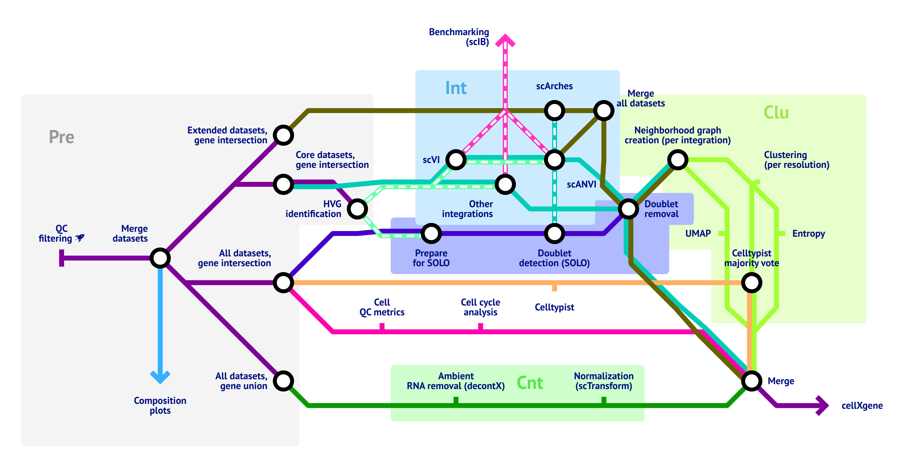

# scRAFIKI - Single-cell RNA-seq Atlas Framework for Integration and Key Insights

scRAFIKI is a pipeline designed to integrate single-cell RNA-seq datasets to generate atlases. It incorporates several integration methods, cell filtering and automated annotation tools.

This pipeline is written in nextflow and based on the LUCA pipeline:
  
> Salcher, S., Sturm, G., Horvath, L., Untergasser, G., Kuempers, C., Fotakis, G., ... & Trajanoski, Z. (2022). High-resolution single-cell atlas reveals diversity and plasticity of tissue-resident neutrophils in non-small cell lung cancer. Cancer Cell. [doi:10.1016/j.ccell.2022.10.008](https://doi.org/10.1016/j.ccell.2022.10.008)

## Overview

Created using [Tennessine](https://tennessine.co.uk/metro/f51c720e6111045)

## Documentation

The scRAFIKI pipeline comes with documentation about preprocessing, usage and downstream analysis. It is available [here](https://github.com/Mye-InfoBank/scRAFIKI/wiki).

## Contact

If you encounter any problems with the pipeline or have a feature request, please use the [issue tracker](https://github.com/Mye-InfoBank/atlas-pipeline/issues).
